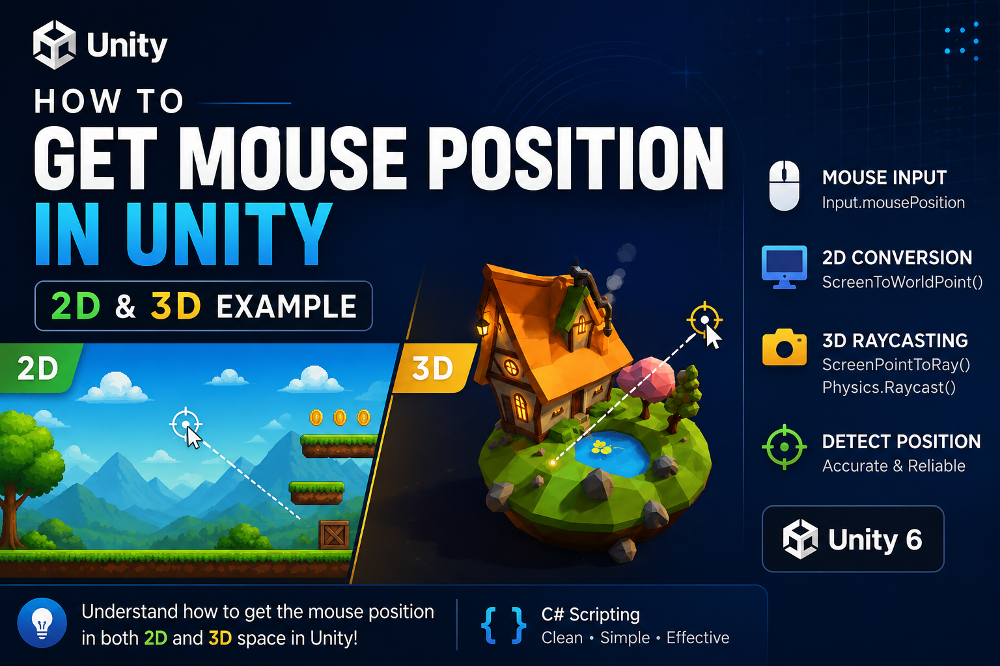

# 🎯 Unity Mouse Position Examples (2D & 3D)

A simple Unity project demonstrating how to get the mouse position in both **2D** and **3D** using two different approaches.

This repository was created as part of my Unity learning journey and accompanies a short LinkedIn tutorial.

---

## 📽️ Demo

🎥 **Watch the full explanation on LinkedIn**

➡️ [View LinkedIn Video](https://www.linkedin.com/posts/abikarthick_unity-unity3d-gamedevelopment-activity-7477455397176492032-L3a8?utm_source=share&utm_medium=member_desktop&rcm=ACoAAFSOB30BmmB1CU-K0qKbTzBatWHrXxYbp5U)

<!-- Replace this image with your thumbnail -->



---

## 📚 What You'll Learn

### 🟦 Unity 2D

* Read the mouse position using `Input.mousePosition`
* Convert Screen Space to World Space
* Use `Camera.ScreenToWorldPoint()`
* Move a GameObject to the mouse position

### 🟩 Unity 3D

* Read the mouse position
* Create a ray from the camera using `ScreenPointToRay()`
* Detect objects using `Physics.Raycast()`
* Get the exact hit point in the 3D world

---

# 📂 Project Structure

```text
Unity-Mouse-Position-Examples
│
├── README.md
├── LICENSE
│
├── 2D
│   └── MousePosition2D.cs
│
├── 3D
│   └── MousePosition3D.cs
│
└── Images
    ├── thumbnail.png
    ├── demo.gif
    └── screenshot.png
```

---

# 🟦 2D Mouse Position

Convert the mouse position from screen coordinates into world coordinates.

```csharp
Vector3 mouseWorldPosition =
    mainCamera.ScreenToWorldPoint(Input.mousePosition);

mouseWorldPosition.z = 0f;

transform.position = mouseWorldPosition;
```

### Result

* Mouse moves a GameObject
* Perfect for:

  * Top-down games
  * Platformers
  * RTS games
  * Puzzle games

---

# 🟩 3D Mouse Position

Use a Raycast to detect where the mouse is pointing.

```csharp
Ray ray = mainCamera.ScreenPointToRay(Input.mousePosition);

if (Physics.Raycast(ray, out RaycastHit hit, float.MaxValue, layerMask))
{
    transform.position = hit.point;
}
```

### Result

* Detects the exact position on a surface
* Great for:

  * RTS games
  * Third-person games
  * Building systems
  * Object placement
  * Shooting mechanics

---

# 💡 Key Difference

| Unity 2D                     | Unity 3D                          |
| ---------------------------- | --------------------------------- |
| ScreenToWorldPoint()         | ScreenPointToRay()                |
| Direct coordinate conversion | Raycast into the world            |
| Simpler workflow             | More accurate for 3D environments |

---

# 🛠️ Technologies Used

* Unity 6
* C#
* Unity Input System (Mouse Input)
* Physics.Raycast
* Camera.ScreenToWorldPoint

---

# 🚀 Future Improvements

* Click-to-Move example
* Object selection
* Drag & Drop mechanics
* Mouse hover detection
* Grid-based placement
* Visual debugging with Gizmos

---

# 🤝 Connect With Me

* 💼 **LinkedIn:** [Abikarthick G](https://www.linkedin.com/in/abikarthick)

* 💻 **GitHub:** [ABIKARTHICKGDEV](https://github.com/ABIKARTHICKGDEV)

---

⭐ If you found this repository useful, consider giving it a star!
